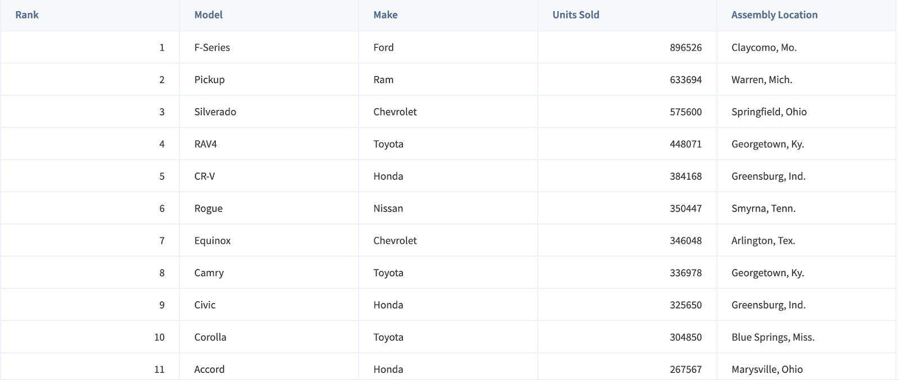

# Overview

FusionGrid provides a data grid component that is highly customizable and blends nicely with your website or mobile application. This data grid allows you to display millions of records with filtering, sorting, and grouping capabilities.

It is lightweight and customizable, and it works with both web and mobile applications. It allows you to build data grids in dashboards with the same simplicity and elegance as FusionCharts. The goal of FusionGrid is to provide an intuitive, clean, easy-to-use, and fully responsive data grid solution that works seamlessly on all modern browsers. FusionGrid offers unparalleled flexibility and power with blazing speed and superior quality with an array of features under its belt.

# How FusionGrid Works

FusionGrid is an enterprise-class, JavaScript-based data grid component created to deliver a fast and feature-rich data visualization experience. FusionGrid comes along with some of the following features:

* [Column Filter](/fusiongrid/tutorials-fusiongrid/column-filter)
* [Data Export](/fusiongrid/tutorials-fusiongrid/export-gridData)
* [Row Selection](/fusiongrid/tutorials-fusiongrid/row-selection)
* [Column Grouping](/fusiongrid/tutorials-fusiongrid/column-grouping)
* [Real-time Data Update](/fusiongrid/tutorials-fusiongrid/updateData-realtime)
* [Row Sorting](/fusiongrid/tutorials-fusiongrid/row-sorting)
* [Search/Quick Filter](/fusiongrid/tutorials-fusiongrid/search-filter)
* [Row Transition](/fusiongrid/tutorials-fusiongrid/row-transition-animation)

In this article, we will walk you through the necessary steps to add FusionGrid to an existing JavaScript project. In this tutorial, we will be rendering an automobile ranking grid.

# Installing FusionGrid
You can install 'fusiongrid' via the CDN/local directory or using npm.

## Install using CDN

To install FusionGrid, let’s include the JavaScript files and CSS from CDN/local directory. 
```bash
https://cdn.fusioncharts.com/fusiongrid/latest/fusiongrid.js 
https://cdn.fusioncharts.com/fusiongrid/latest/fusiongrid.css
```
## Install using npm

Open the terminal and follow the example below:
```bash
npm install fusiongrid
```
## Using FusionGrid

After installation we are ready to start of first grid. Define a schema and gather your data.

### Grid preparation 

The following is a step by step example on how to start your grid.
```json
<!doctype html>
<html>
  <head>
        <!-- FusionGrid JS files -->
    <script src="https://cdn.fusioncharts.com/fusiongrid/latest/fusiongrid.js"></script>
    <link rel="stylesheet" href="https://cdn.fusioncharts.com/fusiongrid/latest/fusiongrid.css">
  </head>
  <body>
    <h1>Hello from FusionGrid!</h1>
  </body>
</html>
```

Next, let’s add an 'HTML' div along with 'width' and 'height' styles. This div will be used as a container to render the grid.

```json
<!doctype html>
<html>
  <head>
        <!-- FusionGrid JS files -->
    <script src="https://cdn.fusioncharts.com/fusiongrid/latest/fusiongrid.js"></script>
    <link rel="stylesheet" href="https://cdn.fusioncharts.com/fusiongrid/latest/fusiongrid.css">
  </head>
  <body>
    <h1>Hello from FusionGrid!</h1>
    <div id="grid-container" style="width: 100%; height: 450px;"></div>
  </body>
</html>
```

FusionGrid uses FusionDataStore, an in-browser tabular data storage. Like most of the grid libraries, instead of asking you to convert your data to ‘our format’, FusionDataStore lets you define your own data schema and pass the data to FusionGrid accordingly. The following is an example of the automobile ranking grid.

Let’s start by defining the schema.
```json
var schema = [
  {
	name: 'Rank',
	type: 'number',
  },
  {
	name: 'Model'
  },
  {
	name: 'Make'
  },
  {
	name: 'Units Sold',
	type: 'number'
  },
  {
	name: 'Assembly Location'
  }
];
```
Next, let’s define the data based on the above schema.

```json
var data = [
  [1, "F-Series", "Ford", 896526, "Claycomo, Mo."],
  [2, "Pickup", "Ram", 633694, "Warren, Mich."],
  [3, "Silverado", "Chevrolet", 575600, "Springfield, Ohio"],
  [4, "RAV4", "Toyota", 448071, "Georgetown, Ky."],
  [5, "CR-V", "Honda", 384168, "Greensburg, Ind."],
  [6, "Rogue", "Nissan", 350447, "Smyrna, Tenn."],
  [7, "Equinox", "Chevrolet", 346048, "Arlington, Tex."],
  [8, "Camry", "Toyota", 336978, "Georgetown, Ky."],
  [9, "Civic", "Honda", 325650, "Greensburg, Ind."],
  [10, "Corolla", "Toyota", 304850, "Blue Springs, Miss."],
  [11, "Accord", "Honda", 267567, "Marysville, Ohio"],
  [12, "Tacoma", "Toyota", 248801, "San Antonio, Tex."],
  [13, "Grand Cherokee", "Jeep", 242969, "Detroit, Mich."],
  [14, "Escape", "Ford", 241338, "Louisville, Ky."],
  [15, "Highlander", "Toyota", 239438, "Princeton, Ind."],
  [16, "Sierra", "GMC", 232325, "Flint, Mich."],
  [17, "Wrangler", "Jeep", 228032, "Toledo, Ohio"],
  [18, "Altima", "Nissan", 209183, "Smyrna, Tenn."],
  [19, "Cherokee", "Jeep", 191397, "Belvidere,     Ill."],
  [20, "Sentra", "Nissan", 184618, "Canton, Miss."],
];
```
Notice the order of data in the array items. It follows the same order as defined in the schema: Rank, Model, Make, Units Sold, Assembly Location. If you decide to shuffle the order of properties in the schema, then your data should also reflect in the same way.
Now that we have defined the schema and data, let’s pass it to FusionDataStore by creating a data table:

```json
var dataStore = new FusionGrid.DataStore();
var dataTable = dataStore.createDataTable(data, schema, {
  enableIndex: false
});
```
## Rendering the Grid

Now, that we have all the dependencies ready, we render our grid as shown below.

```json
// Preparing the schema and data

var schema = [
    {
        name: 'Rank',
        type: 'number',
    }, {
        name: 'Model'
    },
    {
        name: 'Make'
    },
    {
        name: 'Units Sold',
        type: 'number'
    },
    {
        name: 'Assembly Location'
    }
];

 var data = [
    [1, "F-Series", "Ford", 896526, "Claycomo, Mo."],
    [2, "Pickup", "Ram", 633694, "Warren, Mich."],
    [3, "Silverado", "Chevrolet", 575600, "Springfield, Ohio"],
    [4, "RAV4", "Toyota", 448071, "Georgetown, Ky."],
    [5, "CR-V", "Honda", 384168, "Greensburg, Ind."],
    [6, "Rogue", "Nissan", 350447, "Smyrna, Tenn."],
    [7, "Equinox", "Chevrolet", 346048, "Arlington, Tex."],
    [8, "Camry", "Toyota", 336978, "Georgetown, Ky."],
    [9, "Civic", "Honda", 325650, "Greensburg, Ind."],
    [10, "Corolla", "Toyota", 304850, "Blue Springs, Miss."],
    [11, "Accord", "Honda", 267567, "Marysville, Ohio"],
    [12, "Tacoma", "Toyota", 248801, "San Antonio, Tex."],
    [13, "Grand Cherokee", "Jeep", 242969, "Detroit, Mich."],
    [14, "Escape", "Ford", 241338, "Louisville, Ky."],
    [15, "Highlander", "Toyota", 239438, "Princeton, Ind."],
    [16, "Sierra", "GMC", 232325, "Flint, Mich."],
    [17, "Wrangler", "Jeep", 228032, "Toledo, Ohio"],
    [18, "Altima", "Nissan", 209183, "Smyrna, Tenn."],
    [19, "Cherokee", "Jeep", 191397, "Belvidere, Ill."],
    [20, "Sentra", "Nissan", 184618, "Canton, Miss."],
];

// Getting the grid-container
var container = document.getElementById('grid-container-for-card');

// Passing data through DataStore
var dataStore = new FusionGrid.DataStore();
var dataTable = dataStore.createDataTable(data, schema, {
    enableIndex: false
});
var grid = new FusionGrid(container, dataTable, {});

// Render the grid
grid.render();
```
## See Your Grid


### Next Steps

After you have installed FusionGrid for the framework of your choice, refer to the following tutorials to get started with grids:

- [Get Started with Angular](/fusiongrid/installation/getting-started-angular)
- [Get Started with React](/fusiongrid/installation/getting-started-react)
- [Get Started with Vue](/fusiongrid/installation/getting-started-vue)
